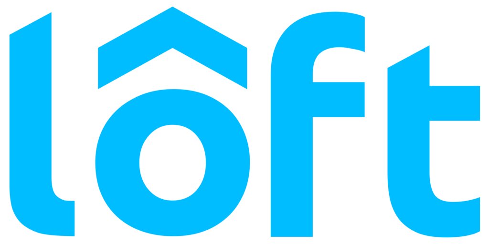

# k9s extension for Docker Desktop

This provides an extension integration with Docker Desktop to allow k9s
quickly and easily through the Docker Desktop interface.


## Prerequisites

In order to run this extension, you must have Docker Desktop 4.8.0 or later
installed.

If you would like to contribute or modify the extension, there are additional
requirements. This extension is comprised Go and React JavaScript code.
Building the extension can be done using containerized build tools, but you may
want to install development environments for these tools.

Runtime Requirements:

- [Docker Desktop 4.8.0 or later](https://www.docker.com/products/docker-desktop/)

Development Recommendations:

- [Go programming language](https://go.dev/doc/install)
- [React reference](https://reactjs.org)
- [Docker Extensions CLI](https://github.com/docker/extensions-sdk)

### `Docker Extension` CLI Setup

The `docker extension` cli is provided by default on the current versions of Docker Desktop.  If you're running an older version you'll manually need to configure the `docker extension` cli, see:

https://docs.docker.com/desktop/extensions-sdk

Note: The build steps assume that the Docker Extensions CLI has been installed.
While `docker-extension` can be called directly, the installation target assumes it has been added as a CLI plugin and
can be called as
`docker extension`.

If you have downloaded the `docker-extension` binary from their Releases page,
follow these steps to have it recognized as a CLI plugin under `docker`:

```sh
mkdir -p ~/.docker/cli-plugins
cp docker-extension ~/.docker/cli-plugins/
```

### Enable kubernetes and docker extensions
In Docker Desktop,
1.  Go to Preferences -> Kubernetes -> Check
   "Enable Kubernetes".
2. Go to Preferences -> Extensions -> Check
   "Enable Docker Extensions".

### Three ways to run extension

#### Running unpublished extension

Users can run the command below to install the extension on their machines.

`docker extension install spurin/k9s-dd-extension:0.0.1`

#### Running published extension
The standard way to get extensions for Docker Desktop is by using the Docker Marketplace. This will install
officially released versions of the extension.  Should it be accepted upon the marketplace, the process is as follows -

Go to Dashboard -> Add Extensions -> Click on Marketplace tab -> Search for k9s -> Click on Install


#### Or Building and Installing extension
If you are making local changes and would like to try them out, you will need
to follow these steps:

1. From a terminal, navigate to `k9s-dd-extension` root directory.
2. Run the following command to build and install the local extension after kubernetes and docker are running:

   ```sh
   make build-install
   ```

### Navigate to extension
From the Docker Dashboard you can now navigate to the Extensions section. It should now list *k9s* as one of the
available extensions. Click on *k9s* from the list and you should be presented with the k9s UI, preconfigured with access to the docker-desktop kubernetes context.

## Thanks!



This extension wouldn't be possible without the amazing efforts of [loft](https://loft.sh/) and their open sourced [Vcluster Docker Desktop Extension](https://hub.docker.com/extensions/loftsh/vcluster-dd-extension).  The team at loft were able to solve a necessary problem, i.e. how to access a working kubeconfig that relates to the Docker Desktop in-built Kubernetes Server.  Around this, they also built a handy control loop in React/Typescript that checks whether or not Kubernetes is running.  This extension re-uses the control loops and adds a volume share to the kubeconfig file, therefore permitting access to other containers (in this case, k9s).

Great efforts loft! 🚀
